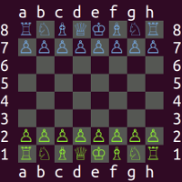

# antichess
[](https://travis-ci.org/sdl1/antichess)

Terminal implementation of suicide chess / anti-chess, with an AI.



## Overview

antichess is a terminal implementation of suicide chess - also called antichess or losing chess - which is a very fun and deep variation of standard chess. The objective of the game is to lose all pieces. Rules are the same as for standard chess, except:

* Captures are obligatory. If one or more captures are available, the capturing player may choose.
* There is no check, checkmate or castling. Kings are treated as a normal piece which may be captured.
* A player that is stalemated wins.
* There is no fifty-move rule or threefold repetition rule.

The first player to lose all their pieces wins. If a player cannot move on their turn, they win.

## Usage

Start a new game as white against the AI, giving it 10 seconds per move thinking time (default is 5):
```shell
./antichess.py -t 10
```

For other command-line options:
```shell
./antichess.py -h
```

Moves are input by specifying the origin and destination squares, e.g.
```shell
e2e4
```
For promotions, specify the desired piece, e.g.
```shell
e7e8Q
```
You can also:

* See valid moves with `v`
* Undo (retract) with `u` or `r`
* Print the board again with `b`
* Resign with `q`
